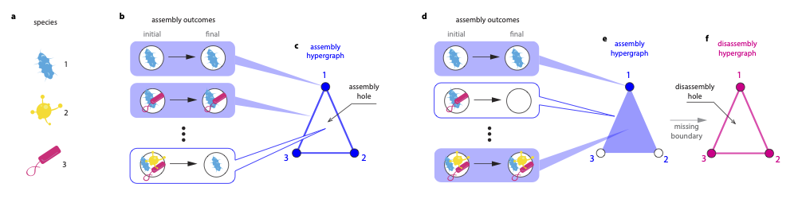

# CoexistHypergraph.jl Documentation

## Installation

### Julia
This package is not registered (yet).
You can install it via the Julia REPL like this:
```julia
julia> using Pkg
julia> Pkg.add(PackageSpec(url="https://github.com/akel123/CoexistHypergraph.jl.git", rev="master"))
```

Or you can install it via the Pkg REPL like this:
```julia
(v1.3) pkg> add https://github.com/akel123/CoexistHypergraph.jl.git#master
```
### R
If you already have [`R`](https://www.r-project.org/) installed then you'll need
to download install [`julia`](https://julialang.org/). You can check if julia is
installed correctly by running the `julia` command in a terminal. If this command
is not found, you will need to add it to your path following the proper
[instructions](https://julialang.org/downloads/platform/) for your operating system.

Once `julia` is properly installed, you will need to install [`JuliaCall`](https://github.com/Non-Contradiction/JuliaCall) in `R`. This is done as with any other `R` package:
```R
install.packages("JuliaCall")
```
And then you will need to do initial set up:
```R
library(JuliaCall)
julia <- julia_setup()
```
If the above step fails, most likely `julia` was not added to your path correctly.
Please see the [`JuliaCall`](https://github.com/Non-Contradiction/JuliaCall)
documentation which has troubleshooting information.

Now `JuliaCall` is installed: [more info](https://cran.r-project.org/web/packages/JuliaCall/JuliaCall.pdf)
## Overview
Description




## Quick Example

```julia
using CoexistHypergraph

N = 8 # number of species in our ecosystem

# create a random community matrix
σA = 0.1 # standard devation for entries
C = 0.1 # success rate of Bernoulli distribution used to populate matrix
A = random_communitymatrix(N, σA, C)

# create a random growth vector
μ = 0.3 # mean of LogNormal distribution used to generate each value
σr = 0.2 # standard deviation of LogNormal distribution used to generate each value
r = random_r_vector(N, μ, σr)


reg = 0
max_dim  = 4
H = assembly_hypergraph_GLV(A, r; method = "permanence", regularization = reg)
R = disassembly_hypergraph(H)

# maybe save these for later if you want
save_hypergraph_dat("~/hypergraphs/assembly_hypergraph.dat", H)
save_hypergraph_dat("~/hypergraphs/disassembly_hypergraph.dat", R)

# get the betti numbers
betti_H = betti_hypergraph_ripscomplex(H; max_dim = max_dim)
```

## Citing
If you use CoexistHypergraph for academic research, please cite the following paper.

Paper Citation

## Developers
-  Marco Tulio
- Aaron Kelley
